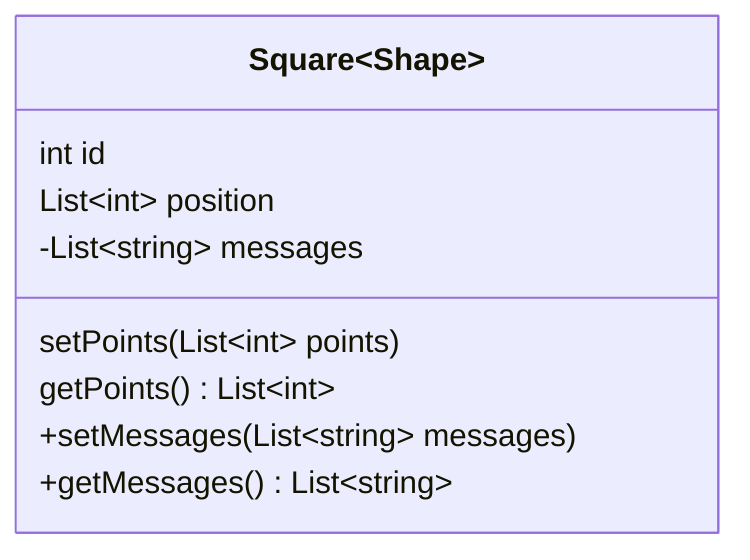
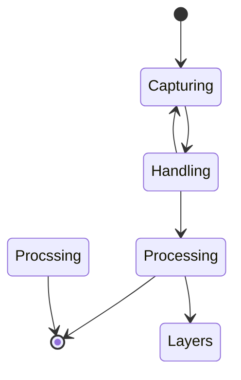

<p align="center">
  <a href="https://pub.dartlang.org/packages/render"></a>
  <a href="https://github.com/polarby#sponsor-me"></a>
  <a href="https://pub.dev/packages/render/score"></a>
  <a href="https://pub.dev/packages/render/score"></a>
  <a href="https://pub.dev/packages/render/score"></a>
 <a href="https://github.com/polarby/render/issues"></a>
 <a href="https://github.com/polarby/render/blob/master/LICENSE"></a>
 <a href="https://github.com/polarby/render/stargazers"></a>
<a href="https://github.com/polarby/render/network"></a>
</p>

----

# Render

A flutter widget to render and convert widgets into a wide range of exportable file formats.
Main features include:

- Render static widgets to export formats (eg. png, jpeg, ...)
- Render moving widgets to export formats (eg. gif, mp4 (including sound), ...)
- Rendering widgets that are not in your widget tree (not displayed/build)

-------

**Table of Contents**

- [🚀 Getting started](#-getting-started)
    - [Installing](#installing)
    - [Quick start](#quick-start)
    - [Usage](#usage)
        - [Image rendering](#image-rendering)
        - [Motion rendering](#motion-rendering)
        - [Recording motion](#recording-motion)
        - [Out of context](#out-of-context)
        - [Handling stream & information flow](#handling-stream--information-flow)
- [🔩 Compatibility](#-compatibility)
    - [Limitations and Performance](#limitations-and-performance)
    - [Supported Platforms](#supported-platforms)
    - [Exportable Formats](#exportable-formats)
        - [Custom formats](#custom-formats)
- [🗄️ Class documentation](#-class-documentation)
    - [Render class](#render-class)
    - [Render Controller](#rendercontroller-class)
- [⚙️ Render: Under the hood](#-render-under-the-hood)
- [⚠ Known issues](#-known-issues)
- [📢 Additional information & Contribution](#-additional-information--contribution)

# 🚀 Getting started

### Installing

### Quick start

```
import 'package:render/render.dart';

final _controller = RenderController();

Render(
    controller: _controller,
    child: Container(),
)

await _controller.captureMotion(Duration(seconds: 4),const MotionSettings());
```

Tip: full interactive example for usage in `./example` folder.

### Usage

Multiple simultaneous operations on one `Render` instance is allowed, but only
one `RenderController` per `Render` instance is expected.

#### Image rendering

Look up [Handle Streams](#handling-stream--information-flow) to get to know how to render images
with a notification stream by using `.captureImageWithStream()`.

#### Motion rendering

Depending on the rendering settings, motion rendering can take quite long, so it is highly 
recommended to use [Streams](#handling-stream--information-flow) with `.captureMotionWithStream()`,
to notify the use about the progress of rendering.

#### Recording motion

#### Out of context

Note that rendering out of context will still build and render each frame of the widget. It will not
reduce processing time in any way.
Although using `Render` package in flutter might be convenient for flutter users to use, it is more
efficient to edit videos (& images) and recreate your rendering widget in a native editing tool.

**Known Confusions:**

- *Sound during capturing*: When capturing motions with sound out of context, it will still play the
  sound in the application. To conquer this, please remove the playing sound of your video widget
  and pass the sound to the audio input of the format.

#### Handling stream & information flow

## 🔩 Compatibility

### Limitations and Performance

`Render` supports transparency across with all compatible file types (video & image). Note, that the
default flutter [Video_player](https://pub.dev/packages/video_player) does not support displaying
transparent videos and will only show a black or white background.

The maximum frame rate of rendering is limited to the maximum frame rate of the current flutter
application. Very high quality rendering (>60fps, >10xlogical pixels) might reduce application
frame rate and consequently the fluency of rendering, resulting is frame jumps in the output file.

### Supported Platforms

|             |  Android  |  iOS   | Web | macOS  |   Windows   |
|:------------|:---------:|:------:|:---:|:------:|:-----------:|
| **Support** |  SDK 16+  |  9.0+  | Any | 10.11+ | Windows 10+ |
| Motion      |    ✔️     |   ✔️   | ❌️️ |   ✔️   |     ✔️      |
| Image       |    ✔️     |   ✔️   | ✔️  |   ✔️   |     ✔️      |

### Exportable Formats

Below are the currently supported and planned formats, that are also mostly supported by the default
flutter [Video_player](https://pub.dev/packages/video_player)
and [Image](https://api.flutter.dev/flutter/widgets/Image-class.html) visualizer.

| Motion Formats | .mp4 | .mov | .gif | .webp | .apng | .mpeg | .mkv | .hls | .dash | .raw | .qtff |
|:-------------:|:---:|:---:|:--:|:---:|:---:|:---:|:---:|:---:|:---:|:---:|:---:|
| Support | ✔️ | ✔️ | ✔️ | [ ] | [ ] | [ ] | [ ] | [ ] | [ ] | [ ] |[ ] |

| Image Formats | .jpg | .png | .bmp | .tiff | .tga | .pvr | .ico | .psd | .exr |
|:-------------:|:---:|:---:|:--:|:---:|:---:|:---:|:---:|:---:|:---:|
| Support | ✔️ | ✔️ | ✔️ | ✔️ | [ ] | [ ] | [ ] | [ ] | [ ] |

#### Custom Formats

## 🗄️ Class documentation

### `Render` class



### `RenderController` class

## ⚙️ `Render`: Under the hood



`Render` contains native flutter methods to capture frames and a light FFmpeg wrapper for format
conversion.

Render widget is a native flutter widget that relies on `RepaintBoundary` to capture flutter widgets
frame by frame. Each frame is needs to be build-out (not necessary in a visible widget tree) to be
able to get captured.
*When `capture()` is called:* The builder will try to build each state of of the child widget to be
able to repaint its boundary. The builder passes the snapshot argument, so you can adjust the
current state of the child widget to the new frame and time. Each frame is written to a temporary
directory, to then be processed by [Ffmpeg](https://pub.dev/packages/ffmpeg_kit_flutter) (a tool for
video, audio and image processing), which then process each frame to the wanted output type.

## 📑 Licence & Patents

`Render` alone is licenced
under [MIT Licence](https://github.com/polarby/render/blob/master/LICENSE),
because Open-Source rocks!

Unfortunately this package also takes advantage of FFmpeg plugin, which is believed to have patented
algorithms. It is not clearly explained in their documentation, but it is believed that FFmpeg and
x264 (both used in this package) include algorithms which are subject to software patents.
For more info check the [FFmpeg-Kit patent disclaimer](https://pub.dartlang.org/packages/render).

If you live in a country where software algorithms are patentable then you'll probably need to pay
royalty fees to patent holders. We are not lawyers though, so we recommend that you seek legal
advice first.

Please refer to [Pub.dev](https://pub.dartlang.org/packages/render) to see the used library's
and possibly different sub-licences.

## ⚠️ Known Issues

* Platform views [cannot be rendered by flutter](https://github.com/flutter/flutter/issues/102866)
  itself (Platform views examples: Google Maps, Camera, etc.).
  There is an active [issue](https://github.com/polarby/render/issues/4) to find an alternative
  for `Render` plugin.

## 📢 Additional information & Contribution

Contributions are very welcome and can be merged within hours if testing is successful.
Please note that this is an open source project and is not maintained by a company, but only
volunteers.

