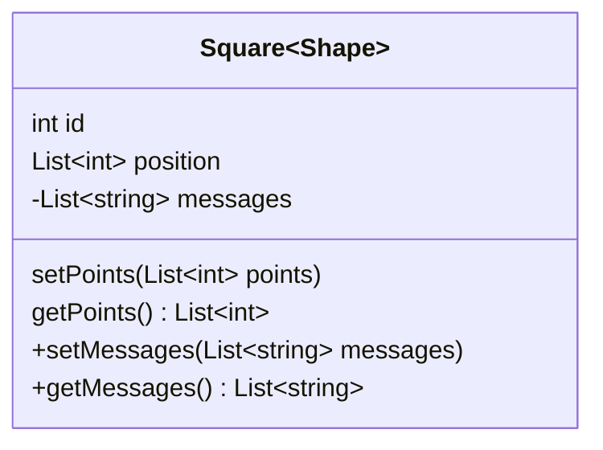
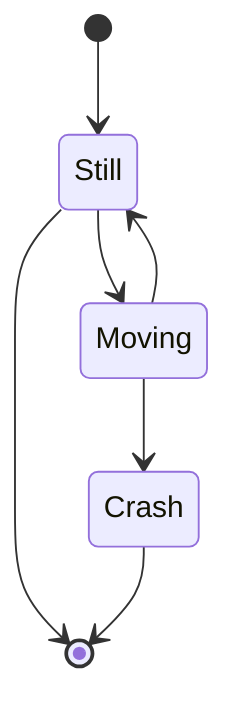

<p align="center">
    
</p>

<p align="center">
  <a href="https://pub.dartlang.org/packages/render"></a>
  <a href="https://github.com/polarby#sponsor-me"></a>
  <a href="https://pub.dev/packages/render/score"></a>
  <a href="https://pub.dev/packages/render/score"></a>
  <a href="https://pub.dev/packages/render/score"></a>
 <a href="https://github.com/polarby/render/issues"></a>
 <a href="https://github.com/polarby/render/blob/master/LICENSE"></a>
 <a href="https://github.com/polarby/render/stargazers"></a>
<a href="https://github.com/polarby/render/network"></a>
</p>

----

# Render

With the mostly native flutter `Render` widget you can render and convert widgets into a wide range
of exportable file formats. Main features include:

- Render static or animated widgets to a broad range of formats from (eg. png, gif to mp4 (including
  sound))
- Rendering widgets that are not in your widget tree (not displayed/build)
- Render multiple variations of your widget simultaneously with layered rendering (including mixed
  building visualisation)

**Note** Rendering front-end elements is not considered the most efficient and
native approach to editing images and videos. Use with own responsibility.

-------

**Table of Contents**

- [Getting started](#-getting-started)
    - [Installing](#installing)
    - [Quick start](#quick-start)
    - [Usage](#usage)
        - [Layers](#layers)
        - [Out of context](#out-of-context)
        - [Handling stream & information flow](#handling-stream--information-flow)
- [Compatibility](#compatibility)
    - [Limitations and Performance](#limitations-and-performance)
    - [Supported Platforms](#supported-platforms)
    - [Exportable Formats](#exportable-formats)
        - [Custom formats](#custom-formats)
- [Class documentation](#class-documentation)
    - [Render class](#render-class)
    - [Render Controller](#rendercontroller-class)
    - [RenderLayer class](#renderlayer-class)
- [Render: Under the hood](#render-under-the-hood)
- [Known issues](#-known-issues)
- [Additional information & Contribution](#additional-information--contribution)

# 🚀 Getting started

### Installing

### Quick start

```
import 'package:render/render.dart';

final _controller = RenderController();

Render(
    controller: _controller,
    child: Container(),
)

await _controller.captureMotion(Duration(seconds: 4),const MotionSettings());
```

Tip: full interactive example for usage in `./example` folder.

### Usage

#### Layers

You might encounter situations where you want to have variations of your widget rendering (eg. one
version with round corners & and one without).
Instead of rendering your widget multiple times you can use *layered rendering*, which renderes the
widget only ones instead of multiple times and consequently reduces your rendering time and
significantly.

Simply wrap a widget within your `Render` build with `RenderLayer`:

```
RenderLayer(
    visualize:false,
    child: ...
) 
```

#### Out of context

#### Handling stream & information flow

## Compatibility

### Limitations and Performance

`Render` supports transparency across with all compatible file types (video & image). Note, that the
default flutter [Video_player](https://pub.dev/packages/video_player) does not support displaying
transparent videos and will only show a black or white background.

The maximum frame rate of rendering is limited to the maximum frame rate of the current flutter
application. Very high quality rendering (>60fps, >10xlogical pixels) might reduce application
frame rate and consequently the fluency of rendering, resulting is frame jumps in the output file.

### Supported Platforms

|             |  Android  |  iOS   |  Web  |  macOS   |    Windows    |
|:------------|:---------:|:------:|:-----:|:--------:|:-------------:|
| **Support** |  SDK 16+  |  9.0+  |  Any  |  10.11+  |  Windows 10+  |
| Video       |    ✔️     |   ✔️   |  ❌️️  |    ✔️    |      ✔️       |
| Image       |    ✔️     |   ✔️   |  ✔️   |    ✔️    |      ✔️       |

### Exportable Formats

Below are the currently supported and planned formats, that are also mostly supported by the default
flutter [Video_player](https://pub.dev/packages/video_player)
and [Image](https://api.flutter.dev/flutter/widgets/Image-class.html) visualizer.

| Motion Formats | .mp4 | .mov | .gif | .webp | .apng | .mpeg | .mkv | .hls | .dash | .raw | .qtff |
|:-------------:|:---:|:---:|:--:|:---:|:---:|:---:|:---:|:---:|:---:|:---:|:---:|
| Support | [x] | [x] | [x] | [ ] | [ ] | [ ] | [ ] | [ ] | [ ] | [ ] |[ ] |

| Image Formats | .jpg | .png | .bmp | .tiff | .tga | .pvr | .ico | .psd | .exr |
|:-------------:|:---:|:---:|:--:|:---:|:---:|:---:|:---:|:---:|:---:|
| Support | [x] | [x] | [x] | [x] | [ ] | [ ] | [ ] | [ ] | [ ] |

#### Custom Formats

## Class documentation

### `Render` class



### `RenderController` class

### `RenderLayer` class

## ⚠️ Known Issues

* Platform views [cannot be rendered by flutter](https://github.com/flutter/flutter/issues/102866)
  itself (Platform views examples: Google Maps, Camera, etc.).
  There is also an active [issue](https://github.com/polarby/render/issues/4) to find an alternative
  for `render` plugin.

## `Render`: Under the hood



`Render` contains native flutter methods to capture frames and a light FFmpeg wrapper for format
conversion.

Render widget is a native flutter widget that relies on `RepaintBoundary` to capture flutter widgets
frame by frame. Each frame is needs to be build-out (not necessary in a visible widget tree) to be
able to get captured.
*When `capture()` is called:* The builder will try to build each state of of the child widget to be
able to repaint its boundary. The builder passes the snapshot argument, so you can adjust the
current state of the child widget to the new frame and time. Each frame is written to a temporary
directory, to then be processed by [Ffmpeg](https://pub.dev/packages/ffmpeg_kit_flutter) (a tool for
video, audio and image processing), which then process each frame to the wanted output type.

## Additional information & Contribution

Contributions are very welcome and can be merged within hours if testing is successful. 

