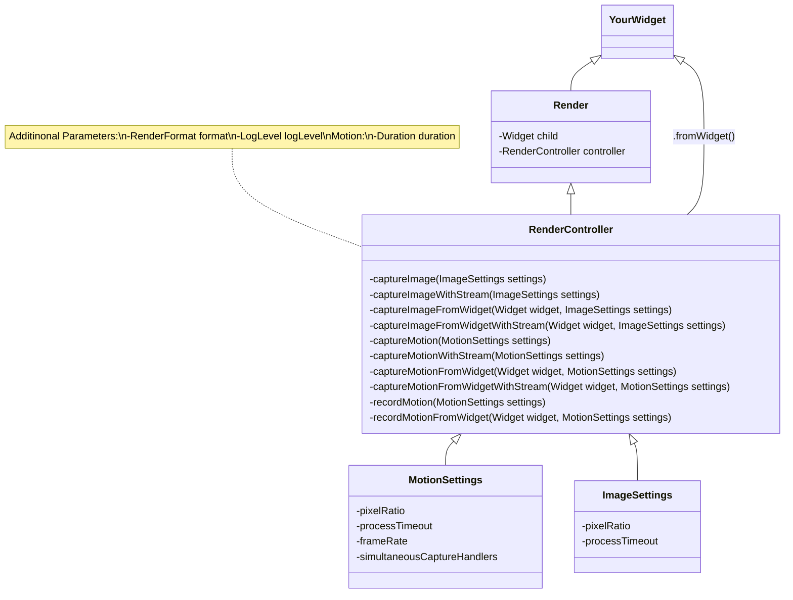
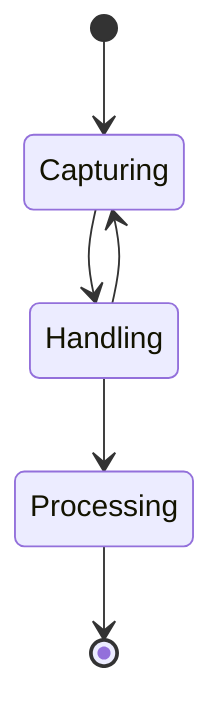

<p align="center">
  <a href="https://pub.dartlang.org/packages/render"></a>
  <a href="https://github.com/polarby#sponsor-me"></a>
  <a href="https://pub.dev/packages/render/score"></a>
  <a href="https://pub.dev/packages/render/score"></a>
  <a href="https://pub.dev/packages/render/score"></a>
 <a href="https://github.com/polarby/render/issues"></a>
 <a href="https://github.com/polarby/render/blob/master/LICENSE"></a>
 <a href="https://github.com/polarby/render/stargazers"></a>
<a href="https://github.com/polarby/render/network"></a>
</p>

----

# Render

A flutter widget to render and convert widgets into a wide range of exportable file formats.
Main features include:

- Render **static** widgets to export formats (eg. png, jpeg, ...)
- Render **moving** widgets to export formats (eg. gif, mp4, ...)
- Record rendering **moving** widgets to export formats
- Rendering widgets that are not in your widget tree (not displayed/build)

*All features support (if supported by format):* Transparency & sound

Not sure about `Render`? Check out the comparison to `screenshot`
and `screen_recorder`[here](#-the-comparison-to-other-packages).

-------


**Table of Contents**

- [🚀 Getting started](#-getting-started)
    - [Installing](#installing)
    - [Quick start](#quick-start)
    - [Usage](#usage)
        - [Image rendering](#image-rendering)
        - [Motion rendering](#motion-rendering)
        - [Recording motion](#recording-motion)
        - [Out of context](#out-of-context)
        - [Handling stream & information flow](#handling-stream--information-flow)
- [🔩 Compatibility](#-compatibility)
    - [Limitations and Performance](#limitations-and-performance)
    - [Supported Platforms](#supported-platforms)
    - [Exportable Formats](#exportable-formats)
        - [Custom formats](#custom-formats)
- [📁 Class documentation](#-class-documentation)
- [❔ The comparison to other packages](#-the-comparison-to-other-packages)
- [🔧 Under the hood](#-under-the-hood)
- [📑 Licence & Patents](#-licence--patents)
- [🚨 Known issues](#-known-issues)
- [📢 Additional information & Contribution](#-additional-information--contribution)

# 🚀 Getting started

### Installing

**Depend on it**

With Flutter:

```
flutter pub add render
```

This will add a line like this to your package's pubspec.yaml (and run an implicit flutter pub get):

```
dependencies:
  render: ^x.x.x
```

Alternatively, your editor might support flutter pub get. Check the docs for your editor to learn
more.

**Import it**

Now in your Dart code, you can use:

```dart
import 'package:render/render.dart';
```

### Quick start

Render provides you with a wide range of methods to capture widgets. All widgets to be captures
must be wrapped in the `Render` widget, with a provided controller to initiate rendering.

Note that the render widget cannot change its size during capturing as dynamic dimensions of output
files are universally not supported by main formats. Wrapping your widget in an expandable widget,
therefore may throw an error.

[comment]: # (@formatter:off)
```dart
import 'package:render/render.dart';

final controller = RenderController();

Render(
    controller: controller,
    child: Container(),
),

final result = await controller.captureMotion(Duration(seconds: 4));
await controller.captureImage(format: ImageFormat.png, settings:  ImageSettings(pixelRatio: 3),);
```
[comment]: # (@formatter:on)

Tip: full interactive example for usage in `./example` folder.

### Usage

In the following the 3 different operations for rendering is mentioned. Multiple simultaneous
operations on one `Render` instance are allowed, but only one `RenderController` per `Render`
instance is expected.

#### Image rendering

There are 4 methods you can call to capture an image:

- `captureImage()` to render the child of `Render` widget, which is in your widget tree.
- `captureImageFromWidget(Widget widget)` to render a invisible provided widget.
- `captureImageWithStream()` to render the child of `Render` widget, which is in your
  widget tree with a notification stream.
- `captureImageFromWidgetWithStream(Widget widget)` to render a invisible provided widget with a
  notification stream.

[comment]: # (@formatter:off)
```dart
final imageResult = await renderController.captureImage(
     format: ImageFormat.png,
     settings: const ImageSettings(pixelRatio: 3),
);

Image.file(imageResult.output); // show result as image
```
[comment]: # (@formatter:on)

Look up [Handle Streams](#handling-stream--information-flow) to get to know how to render images
with a notification streams.

#### Motion rendering

There are 4 methods you can call to capture motion of a widget:

- `captureMotion()` to render the child of `Render` widget, which is in your widget tree.
- `captureMotionFromWidget(Widget widget)` to render a invisible provided widget.
- `captureMotionWithStream()` to render the child of `Render` widget, which is in your
  widget tree with a notification stream.
- `captureMotionFromWidgetWithStream(Widget widget)` to render a invisible provided widget with a
  notification stream.

[comment]: # (@formatter:off)
```dart
final result = await renderController.captureMotionWithStream(
     functionController.duration,
     settings: const MotionSettings(pixelRatio: 4),
     format: Format.gif,
);

final controller = VideoPlayerController.file(result.output);
await controller.initialize();
await controller.play();

VideoPlayer(snapshot.data!); // show result as video
```
[comment]: # (@formatter:on)

**Audio:**

Currently there is [no way to record](https://github.com/polarby/render/issues/5) the internal audio
of a flutter app or specific widgets, therefore the only feasible way for now is to pass audio as a
file. To do this you can pass multiple audio files (from eg. video, url, music, etc) to the target
format:

[comment]: # (@formatter:off)
```dart
controller.captureMotion(
    ...
    format: MovFormat(audio: [
        RenderAudio.url(url),
        RenderAudio.file(file),
    ]),
);
```
[comment]: # (@formatter:on)

Depending on the rendering settings, motion rendering can take quite long, so it is highly
recommended to use methods with stream return, to notify the user about the progress of rendering.
Look up [Handle Streams](#handling-stream--information-flow) to get to know how to render motion
with a notification streams.

#### Recording motion

There are 2 methods you can call to record motion of a widget. Both
functions returns a `MotionRecorder` to `stop()`and access the stream of the activity.

- `recordMotion()` to record the child of `Render` widget, which is in your widget tree.
- `recordMotionFromWidget(Widget widget)` to record a invisible provided widget.

[comment]: # (@formatter:off)
```dart
final recorder = renderController.recordMotion(
       functionController.duration,
       settings: const MotionSettings(pixelRatio: 5),
       format: const GifFormat(),
);

await Future.delayed(Duration(seconds: 5));

final result = await recorder.stop(); // result can then be displayed (see Motion rendering)
```
[comment]: # (@formatter:on)

Depending on the rendering settings, motion rendering can take quite long, so it is highly
recommended to use methods with stream return, to notify the user about the progress of rendering.
Look up [Handle Streams](#handling-stream--information-flow) to get to know how to listen to the
recording stream, to notify the user about the process of rendering/capturing.

#### Out of context

`...fromWidget()` method's replace the need for the [Render] widget as a parent widget.
Simply pass the widget that needs to be rendered in the function.

Note that rendering out of context will still build and render each frame of the widget. It will not
reduce processing time in any way.

[comment]: # (@formatter:off)
```dart
final imageResult = await renderController.captureImageFromWidget(
    Container(), // The widget to be rendered
    format: ImageFormat.png,
    settings: const ImageSettings(pixelRatio: 3),
);

Image.file(imageResult.output); // show result as image
```
[comment]: # (@formatter:on)

**Known Confusions:**

- *Sound during capturing*: When capturing motions with sound out of context, it will still play the
  sound in the application. To conquer this, please remove the playing sound of your video widget
  and pass the sound to the audio input of the format.

#### Handling stream & information flow

Using information stream is highly recommended for rendering motion, due to longer loading phases.
The following example shows how to handle streams of a rendering process:

[comment]: # (@formatter:off)
```dart
final stream = renderController.captureMotionWithStream( // start capturing with stream
    functionController.duration,
    settings: const MotionSettings(pixelRatio: 10),
    format: const GifFormat(),
);

stream.listen((event) { // listens to stream until it closes by itself (when result is present)
    // other events might be result, log or error
    if (event.isActivity){
        final activity = event as RenderActivity;
        // Here could be a setState() call to update your process status
        print("Process: ${activity.progressPercentage}");
    }
});

// result can then be displayed (see Motion rendering)
final result = await stream.firstWhere((event) => event.isResult || event.isFatalError);
```
[comment]: # (@formatter:on)

## 🔩 Compatibility

### Limitations and Performance

`Render` supports transparency across with all compatible file types (video & image). Note, that the
default flutter [Video_player](https://pub.dev/packages/video_player) does not support displaying
transparent videos and will only show a black or white background.

The maximum frame rate of rendering is limited to the maximum frame rate of the current flutter
application. Very high quality rendering (>60fps, >10xlogical pixels) might reduce application
frame rate and consequently the fluency of rendering, resulting in frame jumps in the output file.

**Using settings to keep up performance**

You can take advantage of `simultaneousCaptureHandlers`, `pixelRatio` and `frameRate` in
the `RenderSettings` class.

Handlers process and write frames from the RAM to a local directory. Each frame size is determined
by the size of `pixelRatio`, and the `frameRate`is settings how many handler operations are needed
per
second. Having multiple handlers at the same time heavily influences the performance of the
application during rendering.

The more handlers are running simultaneously the worse gets the framerate and might result in a "
laggy" behavior. Less simultaneously handlers result in longer loading phases, as simultaneous
handling can not be done during capturing anymore.

Note, that if there a lot of unhandled frames it might still result in laggy behavior, as the
application's RAM gets filled with UI images, instead of many handler operations.

To get a good sweet spot you can follow the following introduction for your specific situation:

- Low pixelRatio - high frameRate - many handlers
- high pixelRatio - low frameRate - many handlers
- high pixelRatio - high frameRate - few handlers

### Supported Platforms

|             |  Android  |  iOS   | Web  | macOS  |   Windows   |  Linux   |
|:------------|:---------:|:------:|:----:|:------:|:-----------:|:--------:|
| **Support** |  SDK 16+  |  9.0+  | Any  | 10.11+ | Windows 10+ |   any    |
| Motion      |    ✔️     |   ✔️   | ❌️️  |   ✔️   |  Untested   | Untested |
| Image       |    ✔️     |   ✔️   | ❌️️️ |   ✔️   |  Untested   | Untested |

There currently [no support for web](https://github.com/polarby/render/issues/6), as file writing is
an issue. Windows version might require a simple rewrite of processing structure, but i do not have
access to a device to debug.

### Exportable Formats

Below are the currently supported and planned formats, that are also mostly supported by the default
flutter [Video_player](https://pub.dev/packages/video_player)
and [Image](https://api.flutter.dev/flutter/widgets/Image-class.html) visualizer. Note that the
default video player does not support transparency.

| Motion Formats | .mp4 | .mov | .gif | .webp | .apng | .mpeg | .mkv | .hls | .dash | .raw | .qtff |
|:-------------:|:---:|:---:|:--:|:---:|:---:|:---:|:---:|:---:|:---:|:---:|:---:|
| Support | ✔️ | ✔️ | ✔️ | [ ] | [ ] | [ ] | [ ] | [ ] | [ ] | [ ] |[ ] |

| Image Formats | .jpg | .png | .bmp | .tiff | .tga | .pvr | .ico | .psd | .exr |
|:-------------:|:---:|:---:|:--:|:---:|:---:|:---:|:---:|:---:|:---:|
| Support | ✔️ | ✔️ | ✔️ | ✔️ | [ ] | [ ] | [ ] | [ ] | [ ] |

#### Custom Formats

In case you want to export your rendering as a custom format, that is currently not supported by
this plugin, but supported by FFmpeg conversion, you can follow the instructions below to extend
the format class:

[comment]: # (@formatter:off)
```dart
class YourFormat extends MotionFormat { // you can either extend MotionFormat or ImageFormat
  final dynamic formatSpecificSetting;

  /// Your format description
  YourFormat({
    required this.formatSpecificSetting,
    required super.handling,
    required super.interpolation,
    required super.scale,
  }) : super(
          processShare: 0.3,
          audio: null, // if your format does not have audio support
        );

  @override
  MotionFormat copyWith({RenderScale? scale, Interpolation? interpolation}) {
    throw UnimplementedError();
  }

  @override
  String get extension => "YourExtension";

  @override
  FFmpegRenderOperation processor(
      {required String inputPath,
      required String outputPath,
      required double frameRate}) {
    //return an FFmpegRenderOperation that takes care of all settings 
    return super.processor(
      inputPath: inputPath,
      outputPath: outputPath,
      frameRate: frameRate,
    );
  }
}
```
[comment]: # (@formatter:on)

After creating your format you can simply use it as format in `Render` methods:

[comment]: # (@formatter:off)
```dart
controller.captureImage(format: YourFormat());
```
[comment]: # (@formatter:on)

If you think your format can be of use for other, please submit it as a new issue or pull request
and we can merge it for public use.

## 📁 Class documentation

In the following example you can see the documentation for main connections between classes and
usages every parameter is also documented in the code itself.
Note that there might be parameters which are not shown in the following class diagram.



## ❔ The comparison to other packages

|                                             |     `Render`      | [screen_recorder](https://pub.dev/packages/screen_recorder) | [screenshot](https://pub.dev/packages/screenshot) | 
|:-------------------------------------------:|:-----------------:|:-----------------------------------------------------------:|:-------------------------------------------------:|
|                Capture image                |        ✔️         |                              ❌                              |                        ✔️                         | 
|               Capture motion                |        ✔️         |                              ❌                              |                        ❌️️                        | 
|                Record motion                |        ✔️         |                             ✔️                              |                       ❌️️️                        | 
|                Format export                | Standard + custom |                        Only to bytes                        |                   Only to bytes                   | 
|                    Audio                    |        ✔️         |                              ❌                              |                       ❌️️️                        |
|             Notification stream             |        ✔️         |                              ❌                              |                       ❌️️️                        | 
| <p>Post-capturing <p> interpolation scaling |        ✔️         |                            ❌️️️                             |                       ❌️️️                        |
|          Out of Context capturing           |        ✔️         |                            ❌️️️️                            |                        ✔️                         | 
|            Platform limitations             |        Web        |                              -                              |                       -️️️                        |  

*Comparison is not ought to be biased, if you feel something is wrong please reach out on github*

## 🔧 Under the hood



`Render` contains native flutter methods to capture frames and a light FFmpeg wrapper for format
conversion.

It relies on `RepaintBoundary` to capture flutter widgets frame by frame. Each frame is needs to be
build-out (not necessary in a visible widget tree) to be able to get captured.

During capturing, handlers are asynchronously initiated to do conversion from a captured raw image
and then write the file of eachframe in png format to a temporary directory.

In the processing step, each frame is read from the temporary
directory, to then be processed by [Ffmpeg](https://pub.dev/packages/ffmpeg_kit_flutter) (a tool for
video, audio and image processing), which then process each frame to the wanted output type.
Scaling of frames, sound adaption is also handled here.

## 📑 Licence & Patents

`Render` alone is licenced
under [MIT Licence](https://github.com/polarby/render/blob/master/LICENSE),
because Open-Source rocks, and everything else just sucks for everyone!

**Disclaimer:** I am not a lawyer. If you are concerned enough, seek professional legal advice.

This package also takes advantage of FFmpeg plugin, which is **believed** to have
patented algorithms, but even themselves **"don't know it"**:

Here is what FFmpeg says on its [website](https://ffmpeg.org/legal.html):
> **Does FFmpeg use patented algorithms?** We do not know, we are not lawyers so we are not
> qualified to answer this. Also we have never read patents to implement any part of FFmpeg, so even
> if we were qualified we could not answer it as we do not know what is patented. Furthermore the
> sheer number of software patents makes it impossible to read them all so no one (lawyer or not)
> could answer such a question with a definite no, those who do lie.

For more info on the flutter ffmpeg check
the [FFmpeg-Kit patent disclaimer](https://github.com/arthenica/ffmpeg-kit#15-patents)

Also note that, they may not assert their right to prevent you using the invention.
They would only do so if your use of the invention materially impacts their
sales or otherwise made them more money than taking legal action against you.
[Source](https://softwareengineering.stackexchange.com/a/183809)

Please refer to [Pub.dev](https://pub.dartlang.org/packages/render) to see the used library's
and possibly different sub-licences.

## 🚨 Known Issues

* Platform views [cannot be rendered by flutter](https://github.com/flutter/flutter/issues/102866)
  itself (Platform views examples: Google Maps, Camera, etc.).
  There is an active [issue](https://github.com/polarby/render/issues/4) to find an alternative
  for `Render` plugin.

## 📢 Additional information & Contribution

Contributions are very welcome and can be merged within hours if testing is successful.
Please note that this is an open source project and is not maintained by a company, but only
volunteers.

